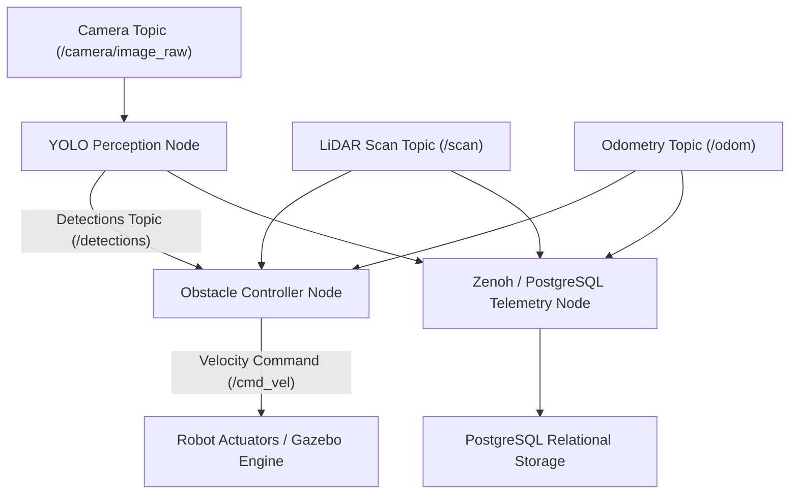

# ROS2 Autonomous Robot Navigation & Vision Perception Pipeline

[](https://github.com/shivangisrivastava013/ROS2-Autonomous-Robot-Navigation/actions/workflows/ci.yml)
[](https://docs.ros.org/en/humble/)
[](https://www.python.org/downloads/)
[](https://github.com/ultralytics/ultralytics)
[](LICENSE)

A ROS 2 package that combines YOLOv8 perception, a Python obstacle-avoidance state machine, Gazebo simulation, RViz visualization, and telemetry through Zenoh and PostgreSQL.

## Demo and project links

- [Portfolio project page](https://shivangisrivastava013.github.io/shivangi-portfolio/#projects)
- [Standalone navigation demo](demo.py)
- [Gazebo simulation launch file](launch/simulation.launch.py)
- [RViz configuration](rviz/navigation.rviz)

---

## System architecture



---

## Capabilities

1. **Valid colcon-Buildable ROS2 Package**:
   - Complete ROS2 package structure with `package.xml`, `setup.py`, `setup.cfg`, `resource/robot_nav`, launch scripts (`launch/`), Gazebo worlds (`worlds/`), and RViz configurations (`rviz/`).

2. **Decoupled State Machine Controller**:
   - Pure Python `ObstacleAvoidanceController` managing 6 dynamic navigation states:
     - `FORWARD`: Waypoint tracking at target forward velocity (`0.35 m/s`).
     - `SLOW_DOWN`: Deceleration when obstacles enter warning threshold (`1.0m`).
     - `TURN_LEFT` / `TURN_RIGHT`: Directional avoidance selecting path with max clearance.
     - `EMERGENCY_STOP`: Immediate halt when vision safety hazards (`person`, `car`, `bicycle`) are detected.
     - `RECOVERY`: Automated reverse and turn maneuver if robot is trapped.

3. **YOLOv8 Vision Hazard Integration**:
   - `PerceptionNode` extracts object bounding boxes and class labels from camera frames, publishing safety alerts over ROS topics.

4. **Edge Telemetry & Relational Storage**:
   - `TelemetryNode` logs real-time robot pose, linear/angular velocity, LiDAR clearances, detection latency, and state transitions to PostgreSQL.

---

## Performance & Navigation Trial Metrics

Generated by running `python demo.py`:

| Metric | Score / Benchmark | Description |
| :--- | :---: | :--- |
| **Standalone Synthetic Trial Completion** | **100.0%** | Trial runs completed without obstacle collision in standalone state machine simulation |
| **LiDAR Clearance Threshold** | **0.45 m** | Hard safety boundary for obstacle avoidance |
| **Vision Detection Threshold** | **0.60** | Confidence threshold for triggering emergency stop |
| **Controller Update Rate** | **10 Hz** | Navigation loop frequency (`dt = 0.1s`) |
| **Unit Test Suite Pass Rate** | **100% (6/6)** | Pytest coverage for controller, LiDAR, and nodes |

---

## Getting started

### 1. Build ROS2 Workspace with Colcon
```bash
# Source ROS2 environment
source /opt/ros/humble/setup.bash

# Create workspace & clone repository
mkdir -p ~/ros2_ws/src && cd ~/ros2_ws/src
git clone https://github.com/shivangisrivastava013/ROS2-Autonomous-Robot-Navigation.git robot_nav

# Build package
cd ~/ros2_ws
colcon build --packages-select robot_nav
source install/setup.bash
```

### 2. Launch Navigation Nodes
```bash
# Launch Perception, Controller, and Telemetry nodes
ros2 launch robot_nav navigation.launch.py
```

### 3. Launch Gazebo Simulation & RViz
```bash
# Launch Gazebo obstacle course, robot spawn, and RViz visualizer
ros2 launch robot_nav simulation.launch.py
```

### 4. Run Pytest Suite & Standalone Trial
```bash
# Execute unit test suite (100% pass rate)
python -m pytest tests/ -v

# Run standalone navigation trial simulation
python demo.py
```

---

## Docker Deployment

```bash
# Build Docker Image
docker build -t ros2-autonomous-robot-navigation:latest .

# Run Containerized Navigation Trial
docker run --rm ros2-autonomous-robot-navigation:latest
```

---

## Repository structure

```
ROS2-Autonomous-Robot-Navigation/
├── package.xml                  # Valid ROS2 package specification (colcon buildable)
├── setup.py                     # ROS2 Python package setup & entry points
├── setup.cfg                    # Setuptools configuration
├── pyproject.toml              # Ruff, Black, Pytest quality configuration
├── requirements.txt            # Python dependencies (NumPy, Ultralytics, PyTest)
├── Dockerfile                  # Containerized deployment specification
├── docker-compose.db.yaml      # Docker Compose setup for PostgreSQL telemetry database
├── resource/
│   └── robot_nav                # ROS2 package index resource marker
├── robot_nav/                   # Modular ROS2 Python Package
│   ├── __init__.py
│   ├── controller.py            # Pure Python ObstacleAvoidanceController state machine
│   ├── detector.py              # YOLOv8 object detector with explicit mock_mode
│   ├── navigation_node.py       # rclpy node subscribing to /scan, /odom -> /cmd_vel
│   ├── perception_node.py       # rclpy node subscribing to /camera/image_raw -> /detections
│   └── telemetry_node.py        # rclpy node streaming telemetry to PostgreSQL / Zenoh
├── launch/
│   ├── navigation.launch.py     # Launch navigation, perception, and telemetry nodes
│   └── simulation.launch.py     # Launch Gazebo world, RViz, and navigation stack
├── config/
│   └── navigation.yaml          # Speeds, stop distances, and safety class thresholds
├── worlds/
│   └── obstacle_course.world    # Gazebo simulation world specification
├── rviz/
│   └── navigation.rviz          # RViz visualization configuration
├── sql/
│   └── schema.sql               # PostgreSQL telemetry database schema
├── scripts/
│   ├── build_embeddings.py     # Vector embedding builder for relocalization
│   ├── ingest_worker.py        # Telemetry DB ingestion worker
│   └── relocalize_query.py     # Relocalization query utility
└── tests/                       # Pytest unit & integration test suite
    ├── test_controller.py
    ├── test_lidar_processing.py
    ├── test_detector_contract.py
    ├── test_telemetry_serialization.py
    ├── test_database_ingestion.py
    └── test_navigation_node.py
```

---

## License

Distributed under the [MIT License](LICENSE).
