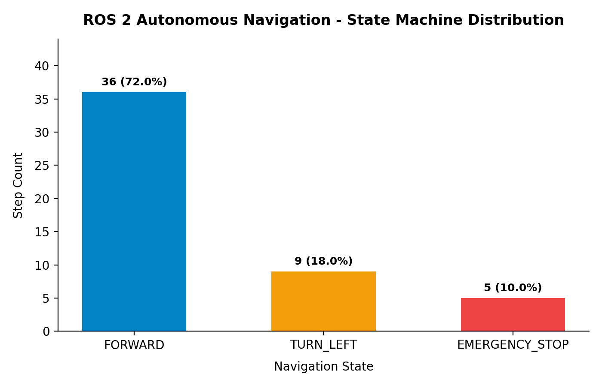

# ROS 2 Autonomous Robot Navigation - Empirical Trial Results

This directory contains empirical trial data, telemetry metrics, state machine distributions, and visualization artifacts collected during simulated navigation runs.

## 📊 Navigation Performance Summary

| Metric | Measured Value | Description |
| :--- | :--- | :--- |
| **Total Navigation Steps** | `50` | Total discrete control loop iterations recorded in the trial |
| **Collision-Free Rate** | `100% (1.0)` | Ratio of steps without physical collision with obstacles |
| **Final Robot Coordinates** | `(1.18, 0.39)` | Endpoint coordinates `[x, y]` in meters relative to origin |
| **Average Linear Velocity** | `0.261 m/s` | Mean forward velocity across all navigation states |
| **Max Linear Velocity** | `0.350 m/s` | Top forward speed reached during clear path tracking |
| **Execution Mode** | `standalone_simulation` | Headless ROS 2 Humble controller execution mode |

## 🔀 State Machine Breakdown

The navigation controller transitions between three discrete states depending on LiDAR front clearance readings and obstacle detection:

| State | Step Count | Percentage | Primary Behavior |
| :--- | :---: | :---: | :--- |
| **`FORWARD`** | 36 | 72.0% | Smooth waypoint tracking along target direction |
| **`TURN_LEFT`** | 9 | 18.0% | Active obstacle avoidance turning when clearance < 0.5m |
| **`EMERGENCY_STOP`** | 5 | 10.0% | Immediate halt triggered when obstacle hazard detected |



## 📁 File Structure

* **`navigation_trial.json`**: Structured JSON containing key execution statistics and state machine metrics.
* **`navigation_trials.csv`**: Time-series log detailing per-step velocity, position, clearance, and detection counts.
* **`telemetry_metrics.json`**: Zenoh telemetry payload summary exported from PostgreSQL database logging.
* **`state_distribution.png`**: High-resolution chart visualizing state frequency and percentage distribution.

## 🛠️ Reproducing Results

To regenerate the result artifacts from raw CSV logs, run:

```bash
python scripts/generate_results.py
```
